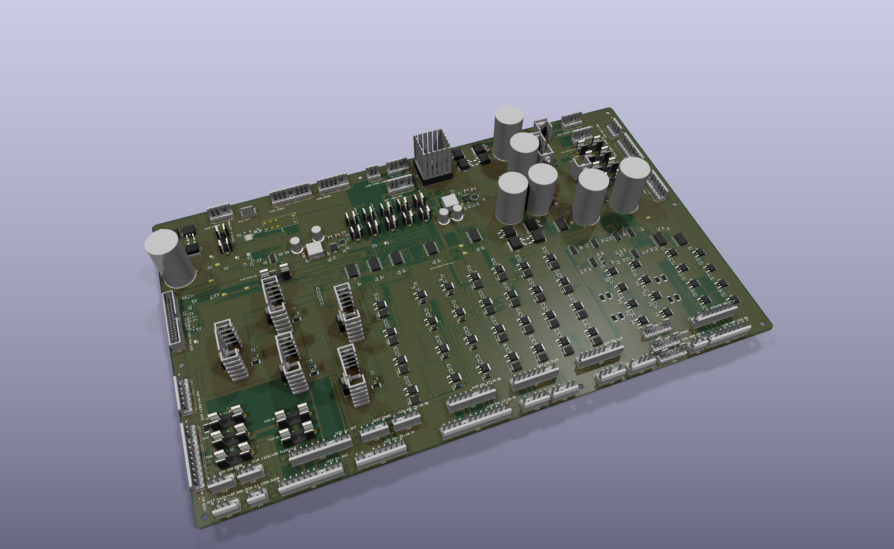

# WPC power/driver board — JLC-2

**JLCPCB electronics redesign, 2026-09-11. Engineering review candidate; not production qualified.**

This is a separate version of the STTNG L7 / Williams A-12697-3 replacement. All populated electronics have purchasable JLCPCB catalog matches. Heatsinks, fasteners and thermal paste retain their existing specifications and may come from other suppliers, as requested. The parent board and schematics are preserved.

JLC-2 includes the flasher-clamp correction found in the additional pre-spin review. **Hold an assembled prototype order:** regulator voltage/backfeed findings and lamp-matrix numerical convergence remain unresolved. The [latest analog-review addendum](docs/CONTINUED_ANALOG_REVIEW.md) establishes convergence of the selected coil replay and adds source-headroom and CPU switch-margin checks. The [earlier verification report](docs/PRESPIN_VERIFICATION.md) retains the original results and failures. Physical fit, thermal and fault qualification also remain open.

## Files to use

- [Native KiCad board](wpc_power_driver_cost.kicad_pcb), [project](wpc_power_driver_cost.kicad_pro) and [schematic](wpc_power_driver_cost.kicad_sch). Project-local symbols, footprints and STEP models are included.
- [Complete review archive](output/JLC-2-review.zip) and [native CAD archive](output/JLC-2-native-cad.zip).
- [Schematic PDF](output/release-candidate/schematic/schematic.pdf), [assembly drawing](output/release-candidate/assembly/assembly.pdf), [STEP assembly](output/release-candidate/3d/board.step), [top](output/release-candidate/3d/top.png) and [perspective](output/release-candidate/3d/perspective.png) renders.
- [Electronic purchase BOM](output/release-candidate/bom/jlc-electronics-purchase.csv). Upload the [SMT BOM](output/release-candidate/bom/jlc-smt-bom.csv) together with the [SMT placement file](output/release-candidate/assembly/jlc-smt-cpl.csv). Through-hole/manual parts and external hardware have separate lists in the same BOM directory.
- [Gerbers and drills](output/release-candidate/gerbers-and-drills.zip), [fabrication specification](output/release-candidate/FABRICATION.txt), [readiness](output/release-candidate/READINESS.json) and [verification report](docs/VERIFICATION.md).

## What changed

| Change | Reason |
|---|---|
| SR1/SR2 replaced by R310–R325, sixteen Basic 4.7 kΩ 0805 resistors | Remove the Extended SIP arrays while preserving all sixteen used pull-up connections. The two unused array elements are omitted. New routing connects to the existing bus and +5 V copper. |
| Common 0805 resistors, 100 nF/10 nF/33 nF capacitors, LEDs and signal diodes use Basic parts | Preserve the required values, ratings and packages. |
| Eight flasher clamp diodes use Basic MDD M7 | Retain 1 A / 1000 V SMA rectifiers; additional SPICE wiring-inductance and temperature sensitivities included. |
| R192 changes from 270 Ω to Basic 470 Ω | Reuse an existing Basic value; +5 V LED current remains 4.95–7.74 mA over the checked voltage/tolerance range. Expect reduced brightness. |
| HCT buffers/latches use TI SN74HCT240DWR / SN74HCT574DWR | JLCPCB sourcing while retaining TTL input thresholds. HC parts are not equivalent at this interface. TI worst-case timing was checked. |
| C2/C4/C9/C12 use Panasonic EEU-FR1E331B | The **B suffix provides factory-formed 5 mm lead spacing**, matching the PCB. The 8 × 11.5 mm body model replaces the oversized model; pad positions and the conservative 10 mm courtyard are retained. |
| Molex ordering-number aliases resolved to purchasable listings | Same connector identities and geometry; consignment-only listings were rejected. |
| SOL21–SOL28 diode cathodes connected to +20 V on the board | STTNG leaves these tieback pins open. The added copper prevents the flasher harness from relying on MOSFET avalanche. No components added. |
| JLC-2 labels and portable libraries/models | Clearly identify the new revision and open it without the old Mac installation. |

Existing components retain their positions and pad geometry. JLC-2 merges SOL21–SOL28_TB into +20 V; other existing pad nets remain unchanged. The board remains 449.152 × 272.910 mm, four layers, 1.6 mm nominal, with **70/35/35/70 µm finished copper**, ENIG and at least 20 µm finished plated-barrel copper. Mounting geometry and the cooling arrangement are retained. R319 was relocated after an independent 3D check detected contact with the conservative fuse-holder envelope; the final model has no reported intersections.

## Sourcing result

| Inventory | Count |
|---|---:|
| Populated electronic references in the native design | 405 |
| SMT placements | 330 |
| Basic placements / distinct Basic codes | 194 / 15 |
| Extended SMT placements | 136 |
| Distinct Extended codes, including through-hole parts | 54 |
| Total distinct JLCPCB codes | 69 |
| Purchased electronic units, including separate fuse clips | 435 |

All 69 public listings were checked for `isBuyComponent=1`, exact normalized ordering-number match and Basic/Extended classification. A listing is not a reservation or assembly quote. **Twelve types need preorder or replenishment for one board**, including the 28 solenoid MOSFETs, large reservoir capacitors, bridge diodes and 32 fuse clips. Quantities, snapshot stock, dates and catalog links are recorded in the purchase BOM and [sourcing audit](output/release-candidate/reports/jlc-sourcing.json).

Extended parts remain where a suitable Basic replacement was not established: the 100 V logic-level power MOSFETs, rated rectifiers and reservoirs, HCT logic, regulators, precision feedback/UVLO resistors, C0G compensation capacitors, exact connectors and fuses. The Basic 470 pF candidates found were X7R, not the selected C0G compensation part. This is a documented selection, not a proof of the lowest possible cost across every future catalog entry.

## Assembly and qualification

The SMT upload pair covers only the 330 SMT references. Use [through-hole/manual BOM](output/release-candidate/bom/jlc-through-hole-manual.csv), [32 clip centers](output/release-candidate/assembly/fuse-clip-centers.csv) and [external hardware BOM](output/release-candidate/bom/external-hardware.csv) for the remaining assembly. F101/F102 take two clips each and **no cartridge**; F103–F116 take two clips plus the specified cartridge. There are fourteen cartridges total. Do not double-count the clips from the generic BOM.

JLCPCB's actual assembly preview must confirm rotation, polarity, pin 1, body centers and exposed-pad stencil treatment. CPL coordinates use the same absolute origin as the Gerbers, with negative Y and normalized native KiCad rotations. No order, upload or supplier message has been submitted.

Follow the retained [connector-key schedule](docs/ASSEMBLY_NOTES.md) and [first-article procedure](docs/ASSEMBLY_AND_FIRST_ARTICLE.md). **STTNG only:** J122 pins 5, 6, 8, 9 and J126 pins 10–13 now carry +20 V as flasher-clamp returns. These pins are unused in the STTNG harness; J126 pin 9 remains the key. Do not connect a different-voltage tieback harness. J106/J111 also retain the parent design's differences; this is not a universal A-12697 replacement. Nominal or conservative CAD envelopes cannot establish cabinet fit, harness access, screw engagement or tolerance clearance. The generic fuse-holder envelope is deliberately conservative and is not an exact Keystone 3517 solid model.

The routed native PCB is authoritative. Do not rerun the historical placement/project generators or one-time migration tools over it. `parts-selection-draft.json`, research alternatives and `docs/baseline/` are historical working material, not the purchasing or release authority.

Primary substitution references: [Panasonic formed-lead capacitor](https://industrial.panasonic.com/tw/products/pt/aluminum-cap-lead/models/EEUFR1E331B), [MDD M7](https://www.microdiode.com/uploadfiles/PDF/M1-THRU-M7-SMA.pdf), [TI HCT240](https://www.ti.com/lit/ds/symlink/sn74hct240.pdf), [TI HCT574](https://www.ti.com/lit/ds/symlink/sn74hct574.pdf). Every selected JLCPCB listing is linked in the purchase BOM.
