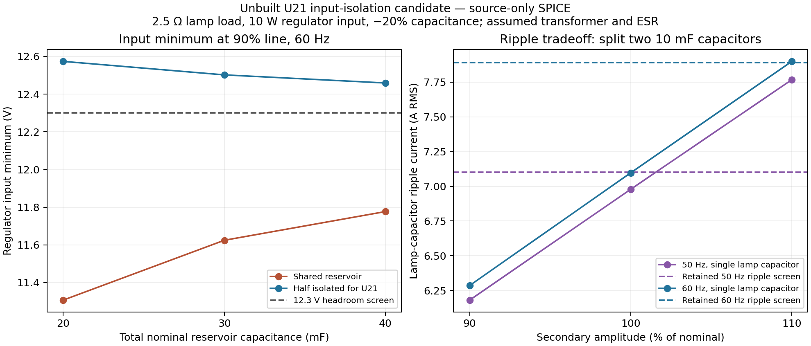

# Continued analog review of JLC-2

The native JLC-2 board and its manufacturing archives are unchanged. **Continue to hold an assembled prototype order.** This addendum resolves the selected coil replay's loss convergence and narrows the +12 V investigation. The lamp-matrix convergence and regulator findings still need disposition. The [previous report](PRESPIN_VERIFICATION.md) remains the record of the original tests, including failures.

## Coil replay: convergence established for the selected model

The complete 118-edge coil-1 sequence from the recorded PinMAME gameplay window was replayed with the unmodified Diodes Inc. S3M model. Gate resistance, MOSFET model, 86 V supply, 3.78 Ω / 12 mH coil and command edges are unchanged. As in the earlier segmented investigation, only long, settled OFF gaps are shortened; at least 100 ms remains, and energy is averaged over the original ten-second window.

| Maximum timestep | MOSFET loss averaged over original window | Modeled temperature at 50 °C ambient | Peak drain voltage | Peak coil current |
|---|---:|---:|---:|---:|
| 0.625 µs | 0.1588591 W | 59.84926 °C | 87.3493 V | 22.676 A |
| 0.3125 µs | 0.1588714 W | 59.85003 °C | 87.3493 V | 22.676 A |

Both runs complete without solver errors. Loss changes by **0.0077%**, passing the retained 5% power-convergence criterion. Channel/body-carrier loss and terminal-energy calculations agree at reported precision. A separate complete energy-balance run accounts for source energy, coil heating, flyback-diode loss, MOSFET terminal energy and final inductor storage; its residual is **−89 µJ**, against approximately 1.589 J of MOSFET energy.

Three short two-pulse runs also complete: trapezoidal integration at 0.625 and 0.3125 µs and Gear at 0.625 µs. These agree closely but are supporting checks, not substitutes for the full sequence. The extended full run uses trapezoidal integration, KLU, `reltol=.0001`, `trtol=1` and `chgtol=1e-16`.

This closes the numerical loss question for this particular circuit/model/window. It does **not** validate the previous generic-diode loss estimates, every possible game state, a manufacturer MOSFET model, or semiconductor safe operating area. Peak MOSFET terminal current is about **114 A**, including recovery/displacement current; it must not be represented as the 22.676 A coil-current maximum. The MOSFET model remains an approximate hot-resistance/capacitance fit. Physical switching-waveform and thermal correlation remain required.

Initial 180-second refinement limits were reached while the simulations were advancing. Those incomplete logs are retained alongside the completed longer run; they are not described as intrinsic solver failures.

## +12 V source: capacitor size alone does not resolve headroom

All **72 source-only cases** complete. These cover 50/60 Hz, 90/100/110% secondary amplitude, 2.5/5 Ω lamp loads, 20/30/40 mF total nominal capacitance, and shared versus diode-isolated arrangements. Capacitance is reduced by 20%; the regulator is approximated by a 10 W constant-power input. The shared fixture retains the prior 50 mΩ aggregate reservoir ESR assumption; isolated branches each use 50 mΩ. This is an explicit sensitivity comparison, not an extraction of the two physical capacitors' individual ESR values. This approximates 12 V × 0.75 A at 90% efficiency and does not simulate its controller.

At 90% line, 60 Hz and the 2.5 Ω lamp load:

| Arrangement | Regulator input minimum |
|---|---:|
| Existing two shared 10,000 µF capacitors | 11.3069 V |
| Double the total shared capacitance | 11.7766 V |
| Keep one 10,000 µF capacitor on the lamp rail; isolate the other for U21 through a B560C diode | 12.5734 V |

These results support input isolation as a candidate for further work, rather than simply increasing the shared capacitance. The 12.3 V headroom screen is an engineering estimate; [TI's datasheet](https://www.ti.com/lit/ds/symlink/tps54360b.pdf) requires dropout allowance that depends on current, losses and duty cycle. Actual transformer impedance and loading remain unmeasured assumptions.

The isolated arrangement also makes the remaining lamp capacitor carry more ripple. At high line its modeled RMS current reaches **7.89977 A at 60 Hz**, just above the retained 7.89 A screen, and **7.76768 A at 50 Hz**, above the retained conservative 7.101 A screen. The latter includes the same 0.9 frequency factor used in the prior review. No rating or voltage screen has been relaxed. These values concern the unbuilt candidate, not a newly discovered change in JLC-2's two-capacitor arrangement.

The proposed isolation uses an already-selected B560C part type but would require a new diode placement, new net/routing, C7 reassignment and a fresh electrical, thermal, inrush, mechanical and manufacturing review. **It has not been applied to the CAD or BOM.** The TI switching-model startup trials reached both their 300-second and extended 900-second runtime limits before completing the requested 30 ms. They have no accepted voltage/recovery measurements and are recorded as incomplete, not as physical failures or passes. A source-only pass does not promote this candidate. See the [machine-readable results](../output/verification/continuation/summary.json).

## CPU switch margins

All **16 simplified CPU switch-interface cases** pass. The STTNG manual's printed pages 3-2 and 3-3 show a 5 V comparison reference, +12 V pull-ups, series diodes and an LM339 comparator. The new fixtures bracket the observed excursions with 9.5–13.5 V, use 4.75/5.25 V comparison/output supplies, and include 0.1/100 Ω contact-resistance cases plus an assumed 2 nF harness capacitance.

Input differential margin and settled TTL output levels pass in those fixtures. This supports the inference that the observed +12 V regulation excursions do not themselves establish a switch-reading failure. It does not qualify the entire CPU, other connected boards, startup/partial power or harness faults, and does not change the retained 11.4–12.6 V regulation screen. The models are functional approximations. The [LM339 datasheet](https://www.ti.com/lit/ds/symlink/lm339.pdf) and [manufacturer manual scan](https://archive.org/download/arcademanual_Star_Trek_TNG_OPS/Star_Trek_TNG_OPS.pdf) identify the relevant component limits and circuit topology.

## Lamp-matrix convergence remains open

The original full 2 µs matrix result remains a completed screening run. New trapezoidal refinements of the same device values and command points fail at switching edges: the 1 µs run aborts at 255.800 ms and the 0.5 µs run at 139.133 ms, short of the required 370 ms. A stricter charge-tolerance case aborts at 1.84449 ms. Their partial power measurements cannot be used as whole-window convergence evidence.

Additional 1 GΩ numerical-shunt cases also abort: at 12.082 ms for 1 µs steps and 139.133 ms for 0.5 µs steps. They are recorded as model perturbations, separately from the original matrix, and provide no completed convergence comparison. All executed cases, runtime limits, solver errors and comparisons are retained in the addendum evidence.

## Evidence and remaining gates

Use the [verification addendum ZIP](../output/JLC-2-verification-addendum.zip), [continuation summary](../output/verification/continuation/summary.json) and its per-file hashes. The [source-only plot PDF](../output/verification/continuation/reservoir-tradeoff.pdf) is available for export. The original JLC-2 ZIP files remain the prior review snapshot; this addendum supplies subsequent verification evidence.

The existing ROM/logic, CAD, manufacturing and mechanical-model results remain applicable because the board is unchanged. This continuation did not rerun MAME or imply new gameplay coverage. Remaining work includes the +12 V design/disposition, reverse-power conditions, matrix convergence, actual switching stress, loaded thermal/fault tests and cabinet/harness clearance. Neither successful emulation nor a converged SPICE model establishes physical prototype safety by itself.
