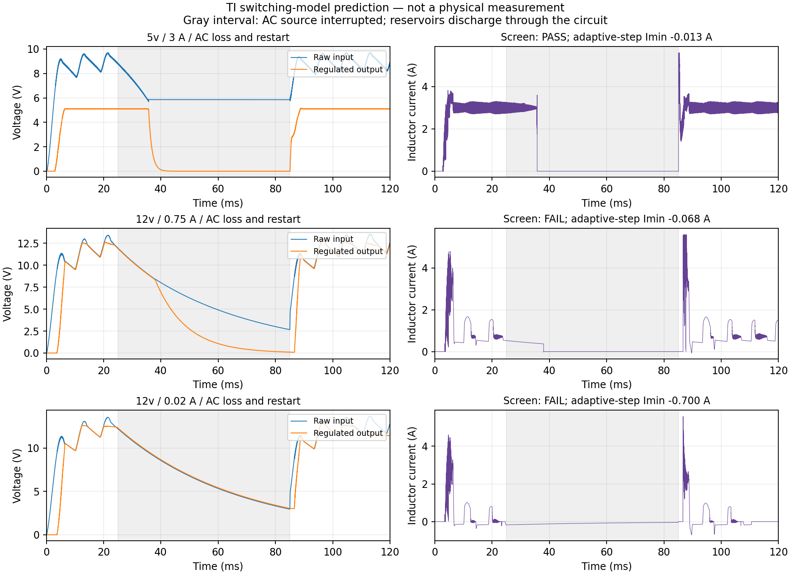
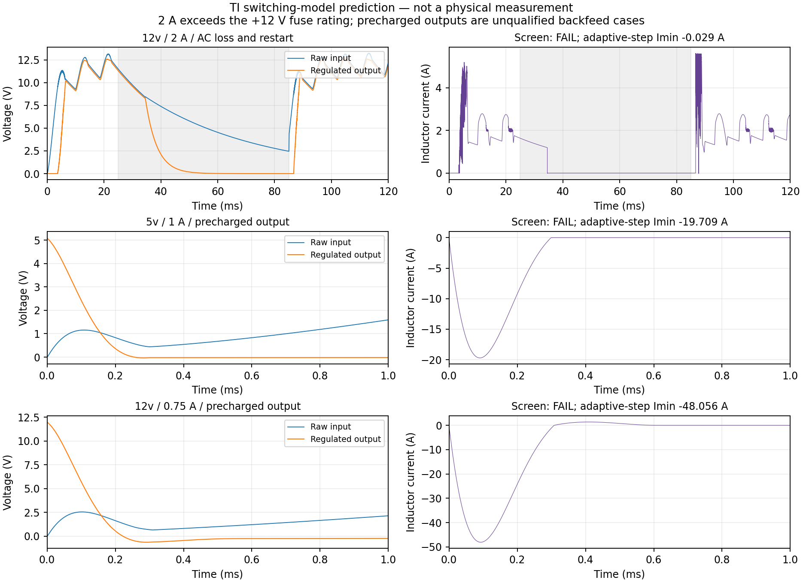

> Historical JLC-2 investigation. For the current hardware and evidence, use [JLC-3 prototype report](PROTOTYPE_JLC3.md).

# Continued pre-spin verification — JLC-2

Subsequent results are in the [analog-review addendum](CONTINUED_ANALOG_REVIEW.md): the selected coil replay now has a completed convergence and energy-balance check. This page preserves the earlier review round, including its incomplete refinements. The regulator and lamp-matrix findings remain open.

This review follows the request to continue verification before a prototype order. Results below are software predictions under stated assumptions. No PCB, cabinet, harness, load or physical fault test has been performed.

**Recommendation: hold an assembled prototype order.** The flasher-clamp fault is corrected and the revised fabrication data passes consistency checks. Regulator voltage/backfeed findings and unresolved numerical convergence prevent a clean electrical sign-off. These need disposition before committing to the assembled board; physical qualification remains a separate later stage.

## Flasher correction

The Williams STTNG manual (printed 2-44 and 3-6/3-7) identifies outputs 20–28 as flashers, with one to four bulbs per channel. Outputs 17/18 are +12 V unregulated gun motors. The previous generic flasher check assumed a connected diode return; the STTNG harness leaves SOL21–SOL28 tieback contacts unused.

A new turn-off screen found that four hot lamps at 30 V with 100 µH of wiring inductance drove the original unclamped 100 V MOSFET model into avalanche, reaching 100.351 V. At 10 µH the same model reached 71.519 V. The assumed inductance range is a sensitivity, not a measurement of the user's harness; the avalanche model does not qualify device SOA.

JLC-2 connects the existing D5–D12 cathodes to +20 V with additional copper. The clamped four-lamp/100 µH comparison peaks at 31.429 V. No parts or footprints were added; sourcing and component placement remain unchanged. Native board, schematics and export labels now say JLC-2. The original JLC-1 archives are superseded.

**STTNG only:** J122 pins 5/6/8/9 and J126 pins 10/11/12/13 now carry +20 V. J126 pin 9 remains the key. This changes the accessible tieback contacts; do not use a harness that assigns another voltage to them. See `clamp-migration.json` for the exact net change. Original parent-project files remain preserved.

## Fresh ROM and logic coverage

PinMAME was built on this Linux machine from pinned commit `2e64cfa9f92955952489854a60ec23397294417e`, with only the passive register-write observer. The supplied `sttng_l7.zip` was used without ROM changes. The deterministic six-ball simulator ran for 240 seconds, completed normally and displayed gameplay with a score of 7,185,500 at 215 seconds. It exercised 25 used output channels, up to four at once, all seven driver registers and all five GI strings. No multiple-column lamp writes were observed. It is finite gameplay coverage, not every game mode or mechanical failure.

The separate 320-second MAME diagnostic trace exercises 27 used output channels. Channel 19 is unused on STTNG. An attempted ordinary MAME gameplay run remained in attract mode; its files are retained and it is not counted as gameplay verification.

`verify_rom_logic.py` walks the actual netlist connections through the active-low ribbon data, HCT240 inverter, clocked HCT574/HCT74 storage and transistor-drive resistor paths to external output pins. It compares 503,067 diagnostic writes and 454,826 gameplay writes with the independent WPC address/pin map. All 957,893 comparisons pass. Another 1,568 directed checks cover unknown latched contents under BLANKING, writes while blanked, disconnected CPU writes, release/clear ordering and individual asynchronous row clears.

PinMAME's `WPC_ZC_IRQ_ACK` implementation explicitly does not emulate the watchdog. The directed tests inject BLANKING and verify downstream behavior; they cannot establish that the physical CPU generates BLANKING correctly. Releasing BLANKING exposes retained latch contents, so firmware must clear outputs before enabling them. Power sequencing below the HCT guaranteed operating range remains a physical measurement gate.

## Expanded SPICE work

Reports and generated decks are under `output/verification/prespin/`.

| Area | Completed result | Practical scope |
|---|---|---|
| Active-load BLANKING | 8 cases / 96 checks pass | 4.5/5.2 V logic, 0.8/2.0 V threshold extremes, 50/60 Hz, 280 pF line/input allowance. Coil and column currents fall after disable; GI stops by the subsequent current zero. Explicit zero writes precede re-enable. |
| Gameplay coils | 14 active channels pass at 5 µs | Worst ten-second windows, 86 V, cold coil resistance, hot MOSFET fit. Finer-step heating investigation is recorded separately. |
| Flashers | 9 channels pass | Actual STTNG bulb counts, thermal heating/cooling envelope, 30 V and 100 µH wiring, corrected clamp returns. One four-bulb case repeated at 2.5 µs. |
| Gun motors | 16 cases pass | Two channels, 8/16 Ω, 0/8 V back EMF, two EMI choke assumptions (4.7 µH and 4.7 mH), 10 mH winding. The manual's EMI diode is in series, not a flyback diode. |
| GI | 20 cases pass | Five recorded gate streams, four AC phase offsets; 18-lamp engineering envelope, approximate triac model. Maximum modeled junction temperature about 104.45 °C. |
| Full 8×8 lamp matrix | 41 checks pass with KLU | Actual ROM row/column writes, 64 diode/thermal-filament paths, eight physical row and column driver models; monitored comparator clears. Initial duplicate-name fixture error and SPARSE convergence failure retained; electrical models unchanged. |
| Full-input regulator sequencing | 6 complete: 1 pass, 5 fail | TI switching model with AC secondary, winding resistance, four rectifiers, ESR and minimum reservoir capacitance; AC interruption/restart rather than an imposed sinking DC input. See the individual findings below. |

The 8 Ω simultaneous motor-stall envelope can exceed the shared 3 A fuse. Passing transistor stress does not mean indefinite stalled operation is supported. Motor R/L/back EMF and EMI choke values have not been measured. The flasher lamp resistance/thermal parameters likewise remain engineering envelopes.

The selected GI time window maximizes gate-command duty; it is not a proof of the hottest possible phase-control waveform. Four phase offsets sample the uncertainty between emulator timing and the physical zero-cross detector. Real trigger quadrant, commutation, EMI and heatsink temperature require measurement.

## Numerical convergence remains open

The initial 5 µs versus 2.5 µs gameplay comparison passes 11 of 12 criteria. Coil 1's modeled temperature changes from 80.585 °C to 76.535 °C, a 4.050 °C difference against the unchanged 4.029 °C limit. Its drain voltage and coil current agree closely. A completed 0.625 µs run gives 70.158 °C. This trend leaves a substantial screening margin below 125 °C, but does not establish converged dissipation or semiconductor SOA.

An independent closed-form R–L calculation passes for all fourteen active gameplay coil channels. It uses the same ROM edge times with a 15 mΩ hot MOSFET resistance assumption. Coil 1's peak is 22.661 A versus approximately 22.676 A in SPICE; its conduction-only loss is 0.1622 W. Maximum conduction-only temperature across the fourteen channels is 63.406 °C. Switching/recovery loss, saturation and mutual heating are excluded, so this cross-check does not close the total-loss convergence finding.

Separately measuring MOSFET channel and body-diode carrier loss, excluding reactive capacitor current, changes the estimated dissipation from 0.409674 W at 5 µs to 0.225823 W at 0.625 µs. Both measures are retained; the difference remains unresolved. Full-window 1.25 µs and 0.3125 µs runs and Gear/KLU alternatives abort. Extreme currents in aborted numerical trials are not treated as physical predictions.

Additional trials shorten only fully settled OFF intervals, preserving the actual ROM pulse widths and at least 100 ms between bursts, and average energy over the original ten seconds. These investigate timestep behavior without changing the circuit. They include the unmodified Diodes Inc S3M model as a separate comparison and tighter solver tolerances. Every completed and aborted trial is retained in `convergence-review.json`; partial-transient measurements cannot pass the completion gate.

The 0.078125 µs refinement was manually interrupted after confirmed numerical time stagnation: the stored point count grew from 36,141,862 to 37,007,060 while the last timestamp remained exactly 0.11920896100388931 s, short of the required 0.8062335 s. The separate manufacturer-diode comparison was also interrupted after approximately one hour, at 0.608892 s of 0.8062335 s. **That vendor-model run was still advancing**; its interruption is a runtime limit, not evidence of a solver or component failure. Both remain incomplete, with no full-window loss or temperature pass claimed. The interrupt records and original partial reports are retained in `replay-loss-segments/runtime-stops.json`.

The full lamp matrix completes at 2 µs with KLU and passes its 41 checks. Both the 1 µs refinement and its stricter-tolerance trial abort. The completed result is useful screening evidence, but **fine-step matrix convergence is not established**. No check limit or device parameter was relaxed to mark these refinements as passes.

## Regulator interruption and reverse power

The new full-input fixtures include the AC secondary, winding resistance, four Schottky rectifiers, ESR and minimum reservoir capacitance. They interrupt AC from 25 to 85 ms and run through 120 ms; the raw reservoir discharges through the circuit instead of being forcibly clamped by a sinking voltage source. Low line is 90% of the assumed nominal secondary, with 8,000 µF on the +5 V raw input and 16,000 µF on the +12 V raw input. The latter also carries a 2.5 Ω raw lamp-load envelope. Output loads are resistors sized for the stated current at nominal voltage; they are not complete models of the CPU and other connected boards during reset. These are assumed source/load conditions, not measured transformer parameters.

A separate 254-check audit matches the saved fixtures to the final netlist: regulator port order, feedback/UVLO/compensation R/C values and connections, inductor and output capacitor values, catch-diode identity/polarity, and the actual raw-rail bridge/reservoir assignment. All pass. Explicit ESR/DCR nodes are collapsed only for connectivity matching; their numerical values and the external source/load remain stated model assumptions.

The voltage screens are +5 V peak ≤5.25 V and final five-millisecond average 4.95–5.20 V; +12 V peak ≤12.60 V and final average 11.40–12.60 V. They also reject negative output below −0.3 V, reverse inductor current below −1 A, excessive forward current and incomplete transients. The reverse-current threshold is an engineering screen, not a vendor SOA rating.

All six full-input transients complete without a simulator error. The +5 V nominal 3 A loss/restart case passes every screen: 5.131 V peak, 5.103 V final average and −0.013 A minimum inductor current. Its final three-cycle output range is 5.097–5.115 V. The other five cases fail the criteria listed below.

| Rail / nominal load | Scenario | Peak output | Minimum inductor current | Final 5 ms average | Screen |
|---|---|---:|---:|---:|---|
| +5 V / 3 A | AC loss/restart | 5.131 V | −0.013 A | 5.103 V | PASS |
| +12 V / 20 mA | AC loss/restart | 12.819 V | −0.700 A | 11.496 V | FAIL: peak |
| +12 V / 0.75 A | AC loss/restart | 12.785 V | −0.068 A | 11.841 V | FAIL: peak |
| +12 V / 2 A | AC loss/restart, overload | 12.669 V | −0.029 A | 11.294 V | FAIL: peak and final average |
| +5 V / 1 A | Precharged output | 5.119 V | −19.709 A | 5.104 V | FAIL: reverse current |
| +12 V / 0.75 A | Precharged output | 12.596 V | −48.056 A | 11.875 V | FAIL: reverse current and negative output |

The precharged-output cases begin with the regulated output capacitors charged and the raw reservoir empty, then apply AC. Both complete numerically, predicting approximately −19.709 A in the +5 V inductor and −48.056 A in the +12 V inductor. The latter output also reaches approximately −0.636 V. These fail the retained limits. This is an unqualified reverse-power condition; the model does not establish the real failure current or survival time. The rail capacitors, ESR and inductor path are present in the fixture, so the result cannot be dismissed solely as the earlier ideal sinking-source artifact.

Both intended +12 V loss/restart cases complete but fail the peak-voltage screen: 12.819 V at 20 mA and 12.785 V at 0.75 A. Their final averages recover within the 11.40–12.60 V limits. The 20 mA maximum occurs near 96.024 ms. The +12 V 2 A stress case peaks at 12.669 V and recovers to an 11.294 V final average; 2 A exceeds that rail's 0.75 A fuse rating and is not an intended continuous load. The final summary records every failed check.

The original final-five-millisecond averages do not describe the full ripple cycle. Over 95–120 ms (three rectified line cycles), the +12 V output ranges from 11.295 to 12.819 V at 20 mA and from 10.918 to 12.785 V at 0.75 A. The latter raw input falls to approximately 10.991 V, leaving insufficient headroom for a buck converter to maintain 12 V. These supplementary observations use the saved 1 µs samples; they preserve the original tests and reveal their limited averaging window. The assumed heavy lamp load, transformer impedance, actual downstream voltage tolerance and dropout/recovery behavior need disposition together.

The `body_reverse_peak` output is instantaneous diode terminal current including displacement current; it is not a separately qualified carrier-current or SOA measurement. Use the inductor-current results and saved waveforms for the reverse-power finding. Exact source files and manufacturer download URLs are identified in `research/vendor-model-sources.json`.

## Revised-board checks

Fresh ERC and DRC have zero errors, zero open connections and zero schematic-parity issues. All 77 warnings have an explicit geometry review. Independent filled-copper analysis verifies 1,393 pads on 363 nets. The source audit checks 10,997 conditions, including the documented clamp-net changes and preservation of original files. The 2,188 static interface checks include the nine connected flasher clamps. Independent Gerber/drill/BOM/CPL parsing passes. Mechanical model inputs are byte-identical to the previously checked 425-instance assembly; no new physical bodies were introduced.

The refreshed +5 V copper model predicts 30.338 mV drop at 3 A and 75 °C on the finer 0.25 mm mesh. The refreshed thermal screening peaks at 121.148 °C, below its 125 °C target, but the small model margin must be correlated on hardware.

## Remaining physical work

Use the staged first-article procedure in `ASSEMBLY_AND_FIRST_ARTICLE.md`. Begin with isolated, current-limited inputs and dummy loads. Verify regulation, actual shutdown/restart currents, physical BLANKING and partial-power behavior before connecting the CPU or playfield. Do not externally energize regulated outputs while their raw inputs are low; reverse-power survival is not qualified. Establish real load/current/temperature and fuse-clearing limits, then verify harness and cabinet fit. None of these physical tests can be replaced by a passing simulator report.

Primary references: [Williams STTNG operations manual](https://archive.org/download/arcademanual_Star_Trek_TNG_OPS/Star_Trek_TNG_OPS.pdf), [pinned PinMAME source](https://github.com/vpinball/pinmame/tree/2e64cfa9f92955952489854a60ec23397294417e), [TI reverse-power guidance](https://e2e.ti.com/support/power-management-group/power-management/f/power-management-forum/1308507/tps54360b-power-output-without-input-in-test-environment). Exact local inputs, commands and hashes accompany the reports; the ROM and manual are not redistributed.
